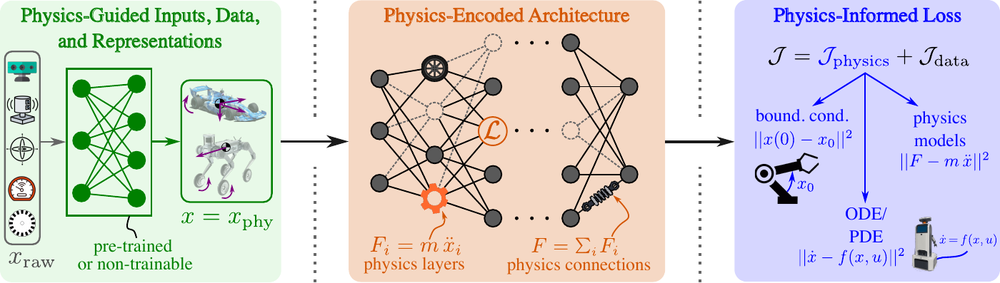
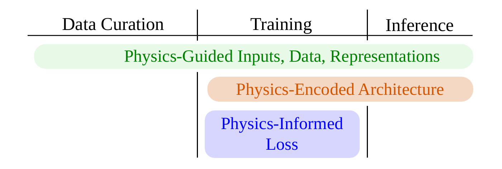
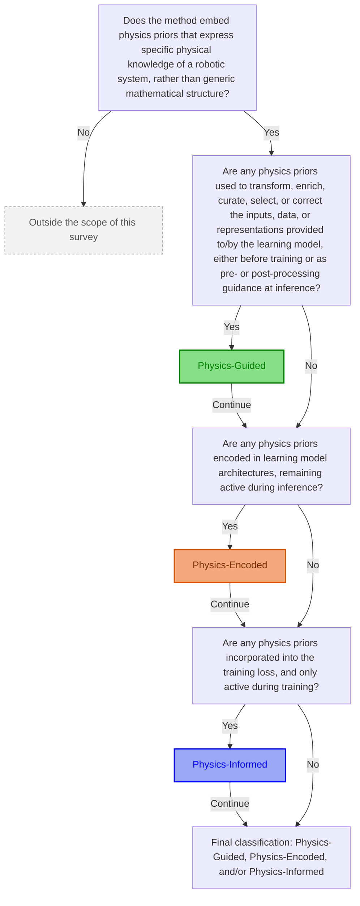
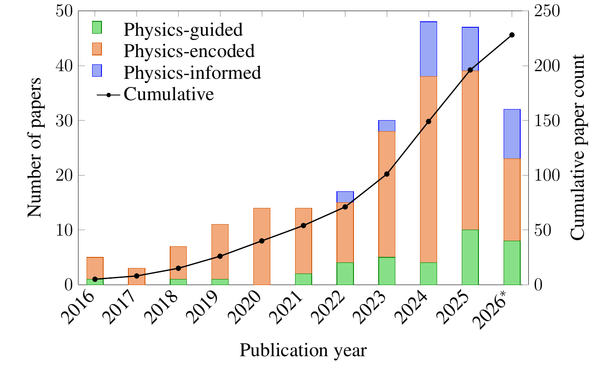
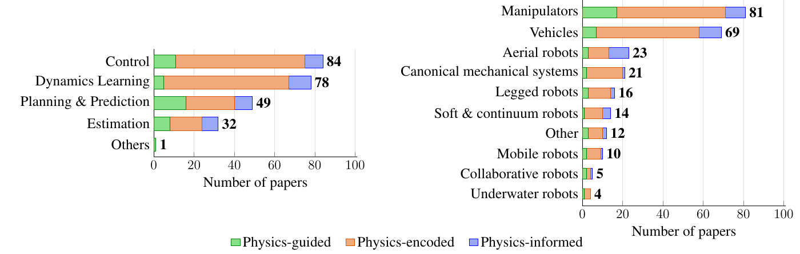
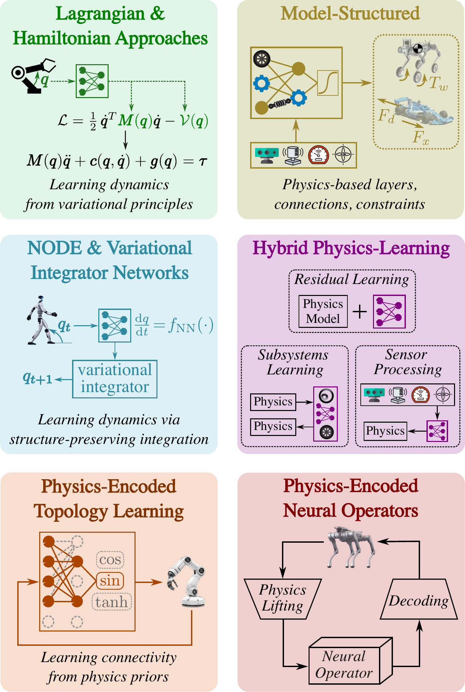

# Embedding Physics Priors in Robot Learning: A Survey

This repository hosts the review paper *Embedding Physics Priors in Robot Learning: A Survey*, with a living catalog of the reviewed papers, classification and search methods, summary tables, and open-source software list. 
We welcome contributions from the **whole community** to keep this survey up to date!  

The catalog mirrors the taxonomy of the survey: 
- **physics-guided** inputs / data / representations,
- **physics-encoded** model architectures,
- **physics-informed** training losses. 

Within each route, the survey groups papers by application: *dynamics learning*, *trajectory planning & prediction*, *control*, *estimation*.

## :fire: Updates

- **Sep. 2026** – Repository initialized from the survey bibliography: all **329** references cited in the manuscript.
- Of these, **232** are physics-embedded robot learning methods (the rest are related surveys, software, and background references).
- By taxonomy route (each method counted once, under its primary route): **16%** physics-guided (36), **71%** physics-encoded (165), **13%** physics-informed (31).

## :page_with_curl: Introduction

Robot learning is constrained by scarce real-world data, complex contact dynamics, and safety requirements. **Physics priors** can act as robotics-specific inductive biases that complement rather than replace data-driven learning. This repository collects the papers reviewed in the survey, grouped by *how* physics is embedded.

### Types of physics priors

The survey considers the following non-mutually-exclusive families of physics priors:

1. **Governing equations** — Newton–Euler, Euler–Lagrange, Hamiltonian and port-Hamiltonian formulations, together with the ODEs and PDEs describing rigid-body and continuum systems.
2. **Conservation laws, symmetries, and invariances** — conservation of energy, momentum, and power, together with symmetry, invariance, and equivariance principles (e.g. SE(3), SO(3), and morphological symmetries).
3. **Geometric and kinematic structure** — manifolds and Lie groups, kinematic trees, subsystem decompositions, connectivity and modularity of multi-body systems, and holonomic and nonholonomic constraints.
4. **Constitutive and interaction models** — friction, contact and impact laws, stiffness, damping, material behavior, and actuator and drivetrain dynamics.
5. **Physical consistency and admissibility** — positive definiteness of inertia matrices, positive semi-definiteness of damping matrices, physically meaningful parameter bounds and sign constraints, passivity, dissipativity, stability properties, actuator limits, and boundary conditions.

> Generic mathematical representations alone are not considered physics priors unless they explicitly encode physical knowledge.

### Robotics applications and platforms

The survey groups the reviewed methods into four application categories:

1. **Dynamics learning** — forward and inverse dynamics, rigid-, soft- and multi-body system identification, friction and contact modelling, continuum-robot shape learning, and equation or governing-law discovery.
2. **Trajectory planning and prediction** — path and motion planning, motion and video prediction, trajectory imitation, planning-oriented policy generation, geometric planning on manifolds, and generative action prediction.
3. **Control** — trajectory and path tracking, inverse-dynamics control, and energy-shaping and passivity-based control.
4. **Estimation** — state and parameter estimation, localization, disturbance and force estimation, fault detection, and condition monitoring.

Robot platforms include manipulators, mobile robots, vehicles, legged robots (quadrupeds and humanoids), soft and continuum robots, collaborative robots, and underwater and aerial robots. *Canonical mechanical systems* (including pendulums, cart-poles, acrobots and mechanical oscillators) are reported separately.

### Machine learning models and methods

While many reviewed works employ **neural networks**, our survey also covers **Gaussian process regression**, **kernel methods**, **sparse identification** and **symbolic regression**, **equation learning**, **Koopman models**, **neural operators**, **variational integrator networks**, and **generative models** (diffusion models, vision-language-action models, and video world models), whenever they employ mechanisms to embed physics priors.

**Reinforcement learning** is *excluded* when physics is incorporated exclusively through RL-specific mechanisms (state or action space design, exploration strategies, safety constraints, and simulator or environment augmentation), which are reviewed by Banerjee et al. RL methods are *included* whenever physics is embedded through one of the three taxonomy routes below.

## :compass: Taxonomy

Three complementary routes (adapted from Faroughi et al., 2024, specialised to robot learning):

[](figures/overview_physics_injection.pdf)

*The three levels at which physics priors enter a learning pipeline: (a) physics-guided inputs, data, and representations; (b) physics-encoded architectures; (c) physics-informed loss functions. Vector version: [`overview_physics_injection.pdf`](figures/overview_physics_injection.pdf).*

1. **Physics-guided** — physics priors select, pre-process, or compute input features, generate or curate training data, or enforce physically consistent representations. Applied at data curation, or as a pre-processing module whose learnable parts are pre-trained or frozen; may stay in the pipeline at training and inference.
2. **Physics-encoded** — the model architecture itself enforces physics via tailored structures, layers, topologies, energy or conservation principles, symmetries, or architectural constraints. Active during both training and inference.
3. **Physics-informed** — the training objective penalises violations of governing equations, typically through residual or regularization terms. Formally active only during training: no effect at inference, since it is part of neither the architecture nor the inputs.

Most existing works use a single route. Jointly using complementary routes may enable a richer exploitation of prior physical knowledge, but systematic comparisons remain limited.

### Lifecycle of physics priors

[](figures/lifecycle.pdf)

*Physics-guided components act during data curation or as pre-processing modules; physics-encoded priors stay active at training and inference; physics-informed losses act only during training. Vector version: [`lifecycle.pdf`](figures/lifecycle.pdf).*

## :twisted_rightwards_arrows: Classification flow

The decision flow below mirrors the one in the survey (Fig. *Decision flow to classify physics-embedded robot learning approaches*). A **scope gate** comes first: a method that embeds only generic mathematical structure, or that is not applied to a robotic system, falls outside the survey. The three labels are then **not mutually exclusive** — every criterion is evaluated in sequence and each *Yes* is kept, so a paper may be physics-guided **and** physics-encoded **and** physics-informed.



## :chart_with_upwards_trend: Publication Timeline

How the reviewed literature evolved over time, by taxonomy route.

[](figures/paper_timeline.pdf)

*2016–2026, 228 of the 232 reviewed methods (4 earlier ones are listed in the tables below). Each paper is counted once, under its primary route. \*2026 covers publications up to August 2026 only. Vector version: [`paper_timeline.pdf`](figures/paper_timeline.pdf).*

| Year | Physics-guided | Physics-encoded | Physics-informed | Total | Cumulative |
|:---|---:|---:|---:|---:|---:|
| 2016 | 1 | 4 | 0 | **5** | 5 |
| 2017 | 0 | 3 | 0 | **3** | 8 |
| 2018 | 1 | 6 | 0 | **7** | 15 |
| 2019 | 1 | 10 | 0 | **11** | 26 |
| 2020 | 0 | 14 | 0 | **14** | 40 |
| 2021 | 2 | 12 | 0 | **14** | 54 |
| 2022 | 4 | 11 | 2 | **17** | 71 |
| 2023 | 5 | 23 | 2 | **30** | 101 |
| 2024 | 4 | 34 | 10 | **48** | 149 |
| 2025 | 10 | 29 | 8 | **47** | 196 |
| 2026 | 8 | 15 | 9 | **32** | 228 |

## :bar_chart: Coverage by application and platform

The tables below break the 232 reviewed methods down by application category and by robot platform. Unlike the timeline, a paper that embeds physics through several routes is counted in **each** matching column, which is why row totals can exceed the number of distinct papers.

[](figures/papers_by_application_and_robot.pdf)

*Distribution of the reviewed methods by application (left) and robot platform (right), split by embedding route. Vector version: [`papers_by_application_and_robot.pdf`](figures/papers_by_application_and_robot.pdf).*

| Application | Physics-guided | Physics-encoded | Physics-informed | Total |
|:---|---:|---:|---:|---:|
| Dynamics Learning | 5 | 62 | 11 | **78** |
| Planning & Prediction | 16 | 24 | 9 | **49** |
| Control | 11 | 64 | 9 | **84** |
| Estimation | 8 | 16 | 8 | **32** |
| Others | 1 | 0 | 0 | **1** |

| Robot platform | Physics-guided | Physics-encoded | Physics-informed | Total |
|:---|---:|---:|---:|---:|
| Manipulators | 17 | 54 | 10 | **81** |
| Mobile robots | 2 | 7 | 1 | **10** |
| Vehicles | 7 | 51 | 11 | **69** |
| Legged robots | 3 | 11 | 2 | **16** |
| Aerial robots | 3 | 10 | 10 | **23** |
| Underwater robots | 1 | 3 | 0 | **4** |
| Soft & continuum robots | 1 | 9 | 4 | **14** |
| Collaborative robots | 2 | 2 | 1 | **5** |
| Canonical mechanical systems | 2 | 18 | 1 | **21** |
| Other | 3 | 7 | 2 | **12** |

*__Canonical mechanical systems__ are the low-DoF textbook testbeds used in place of a robot: pendulum, double pendulum, cart-pole, cart-pendulum, acrobot, inverted pendulum, and mechanical oscillators. __Other__ covers platforms outside every listed class: linear-motor and stepper-motor stages, slider-crank mechanisms, generic rigid multi-body systems, human motion, lower-limb prosthetics, and PDE-solving benchmarks. Methodology papers with no robot platform (`Brunton2016`, `Clawson2014`, `Chen2021_physics`, `Zolman2025`) are excluded from this figure but retained in the application figure.*

*The two panels are also available separately as [`papers_by_application.pdf`](figures/papers_by_application.pdf) and [`papers_by_robot.pdf`](figures/papers_by_robot.pdf). Every generated figure has a matching `\input`-able `.tex` fragment for the manuscript.*

## :mag: Search Terms

The literature on physics-embedded robot learning does not follow a unified terminology, so no single query retrieves it. Papers were collected up to **August 2026** through keyword searches on Google Scholar across the categories of physics embedding, complemented by backward and forward citation tracking from the works found and by the authors' knowledge of the field. We include peer-reviewed journal and conference contributions, plus a few arXiv preprints that are not yet peer-reviewed but contribute significantly to the state of the art.

The terms below are grouped by the aspect of physics embedding they target. They are the vocabulary of this literature, and are published here so that the search can be reproduced and extended: **they retrieve 74% of the reviewed methods by title alone**, and more once abstracts and full text are matched. Combine them with a platform or application term to narrow a query.

<details><summary><b>Core physics-embedding terms</b> (30 terms)</summary>

`physics-informed` &nbsp; `physics-encoded` &nbsp; `physics-guided` &nbsp; `physics-embedded` &nbsp; `physics-constrained` &nbsp; `physics-enhanced` &nbsp; `physics-driven` &nbsp; `physics-inspired` &nbsp; `physics-aware` &nbsp; `physics-based prior` &nbsp; `physics prior` &nbsp; `physical prior` &nbsp; `physical constraint` &nbsp; `physically consistent` &nbsp; `physically plausible` &nbsp; `physically native` &nbsp; `physical consistency` &nbsp; `inductive bias` &nbsp; `structured neural network` &nbsp; `structure-preserving learning` &nbsp; `structured learning mechanical system` &nbsp; `model-structured neural network` &nbsp; `hybrid physics-learning` &nbsp; `hybrid model` &nbsp; `grey-box model` &nbsp; `residual physics` &nbsp; `residual dynamics learning` &nbsp; `knowledge-based neural network` &nbsp; `combining physics and deep learning` &nbsp; `intuitive physics` &nbsp; 

</details>
<details><summary><b>Governing equations & analytical mechanics</b> (20 terms)</summary>

`Lagrangian neural network` &nbsp; `deep Lagrangian network` &nbsp; `DeLaN` &nbsp; `Hamiltonian neural network` &nbsp; `Hamiltonian dynamics learning` &nbsp; `port-Hamiltonian learning` &nbsp; `symplectic network` &nbsp; `symplectic ODE` &nbsp; `Euler-Lagrange learning` &nbsp; `Newton-Euler algorithm` &nbsp; `differentiable Newton-Euler` &nbsp; `rigid-body dynamics learning` &nbsp; `energy-based control learning` &nbsp; `variational integrator network` &nbsp; `neural ODE robotics` &nbsp; `neural differential equation control` &nbsp; `Cosserat rod learning` &nbsp; `continuum mechanics neural network` &nbsp; `structured mechanical model` &nbsp; `mechanical system learning` &nbsp; 

</details>
<details><summary><b>Conservation, symmetry & geometry</b> (17 terms)</summary>

`conservation law neural network` &nbsp; `energy-conserving network` &nbsp; `momentum-conserving network` &nbsp; `equivariant neural network` &nbsp; `SE(3)-equivariant` &nbsp; `SO(3)-equivariant` &nbsp; `equivariant diffusion policy` &nbsp; `symmetry-aware learning` &nbsp; `morphological symmetry` &nbsp; `discrete symmetry robotics` &nbsp; `Lie group learning` &nbsp; `Riemannian manifold learning` &nbsp; `geometric deep learning robotics` &nbsp; `geometric prior policy` &nbsp; `nonholonomic constraint learning` &nbsp; `explicit constraint neural network` &nbsp; `matrix sparsity bias` &nbsp; 

</details>
<details><summary><b>Physics-informed losses</b> (14 terms)</summary>

`physics-informed neural network` &nbsp; `PINN robotics` &nbsp; `PINN control` &nbsp; `physics-informed loss` &nbsp; `PDE residual loss` &nbsp; `ODE residual loss` &nbsp; `physics regularization` &nbsp; `physics-based regularizer` &nbsp; `energy conservation loss` &nbsp; `power consistency loss` &nbsp; `physics-informed neural operator` &nbsp; `physics-informed reinforcement learning` &nbsp; `Eikonal equation neural network` &nbsp; `physics-informed motion planning` &nbsp; 

</details>
<details><summary><b>Operators, identification & equation discovery</b> (17 terms)</summary>

`Koopman operator learning` &nbsp; `deep Koopman` &nbsp; `DeepONet` &nbsp; `Fourier neural operator` &nbsp; `neural operator` &nbsp; `SINDy` &nbsp; `sparse identification nonlinear dynamics` &nbsp; `symbolic regression dynamics` &nbsp; `equation learner network` &nbsp; `governing equation discovery` &nbsp; `topology learning neural network` &nbsp; `sparse Bayesian identification` &nbsp; `system identification neural network` &nbsp; `dynamic identification robot` &nbsp; `inertial parameter identification` &nbsp; `friction identification` &nbsp; `friction-aware learning` &nbsp; 

</details>
<details><summary><b>Probabilistic & kernel methods</b> (10 terms)</summary>

`Gaussian process dynamics` &nbsp; `Gaussian process inverse dynamics` &nbsp; `physically consistent Gaussian process` &nbsp; `structured kernel dynamics` &nbsp; `RKHS dynamics learning` &nbsp; `dissipative Gaussian process` &nbsp; `uncertainty-aware model predictive control` &nbsp; `Bayesian dynamics learning` &nbsp; `neural stochastic differential equation` &nbsp; `uncertainty quantification dynamics` &nbsp; 

</details>
<details><summary><b>Generative & foundation models</b> (16 terms)</summary>

`diffusion policy` &nbsp; `physics-guided diffusion` &nbsp; `diffusion model robot` &nbsp; `diffusion planning robot` &nbsp; `motion diffusion model` &nbsp; `dynamically admissible trajectory` &nbsp; `world model robotics` &nbsp; `video world model` &nbsp; `driving world model` &nbsp; `physics-grounded world model` &nbsp; `physically consistent world model` &nbsp; `vision-language-action model` &nbsp; `physics-aware foundation model` &nbsp; `differentiable physics simulation` &nbsp; `differentiable simulation learning` &nbsp; `differentiable rendering robot` &nbsp; 

</details>
<details><summary><b>Applications</b> (23 terms)</summary>

`robot dynamics learning` &nbsp; `inverse dynamics learning` &nbsp; `forward dynamics learning` &nbsp; `friction model learning` &nbsp; `contact dynamics learning` &nbsp; `actuator dynamics identification` &nbsp; `trajectory planning neural network` &nbsp; `motion planning neural network` &nbsp; `time-optimal motion planning` &nbsp; `motion prediction physics` &nbsp; `trajectory tracking learning` &nbsp; `model predictive control learning` &nbsp; `feedforward control neural network` &nbsp; `state estimation neural network` &nbsp; `sideslip angle estimation` &nbsp; `vehicle state estimation` &nbsp; `tire force estimation` &nbsp; `tyre force estimation` &nbsp; `ground reaction force estimation` &nbsp; `disturbance observer learning` &nbsp; `contact force estimation` &nbsp; `sim-to-real gap dynamics` &nbsp; `fault diagnosis physics` &nbsp; 

</details>
<details><summary><b>Platforms</b> (23 terms)</summary>

`robot manipulator learning` &nbsp; `robotic arm dynamics` &nbsp; `industrial robot dynamics` &nbsp; `parallel manipulator identification` &nbsp; `mobile robot dynamics learning` &nbsp; `vehicle dynamics neural network` &nbsp; `longitudinal vehicle dynamics` &nbsp; `autonomous racing learning` &nbsp; `race car control learning` &nbsp; `autonomous drifting` &nbsp; `anti-lock braking learning` &nbsp; `legged robot dynamics learning` &nbsp; `quadruped dynamics learning` &nbsp; `quadrupedal locomotion learning` &nbsp; `humanoid dynamics learning` &nbsp; `character controller physics` &nbsp; `quadrotor dynamics learning` &nbsp; `aerial robot dynamics` &nbsp; `underwater vehicle dynamics learning` &nbsp; `soft robot dynamics learning` &nbsp; `continuum robot learning` &nbsp; `exoskeleton control learning` &nbsp; `collaborative robot dynamics` &nbsp; 

</details>

*170 terms in 9 groups.*

**Out of scope:** reinforcement learning in which physics enters *only* through RL-specific mechanisms — state or action space design, exploration strategies, safety constraints, simulator or environment augmentation — which is reviewed by Banerjee et al.; and physics-embedded learning outside robotics (fluid, solid and continuum mechanics), which is covered by the related surveys below.

To classify a new paper, walk the [classification flow](#twisted_rightwards_arrows-classification-flow) above. First the scope gate: does the method embed physics priors specific to a robotic system, rather than generic mathematical structure? If so, does physics enter via **inputs/data**, via **architecture**, via **loss**, or a combination? Then open a pull request with the `.bib` entry in the matching file under [`bib/`](bib/).

## Table of contents

- [Physics-Encoded Architectures](#physics-encoded-architectures) (184)
  - [Lagrangian Learning Models (DeLaN / LNN)](#lagrangian-learning-models-delan--lnn) (25)
  - [Hamiltonian Learning Models (HNN / port-Hamiltonian / symplectic)](#hamiltonian-learning-models-hnn--port-hamiltonian--symplectic) (10)
  - [Model-Structured Learning Architectures (MSNNs)](#model-structured-learning-architectures-msnns) (23)
  - [Neural ODEs and Variational Integrator Networks](#neural-odes-and-variational-integrator-networks) (10)
  - [Non-NN Physics-Structured Models (GPR / RKHS / kernels)](#non-nn-physics-structured-models-gpr--rkhs--kernels) (15)
  - [Hybrid Physics-Learning Architectures](#hybrid-physics-learning-architectures) (38)
  - [Physics-Encoded Topology Learning (SINDy / equation learners)](#physics-encoded-topology-learning-sindy--equation-learners) (21)
  - [Neural Operators (Koopman / DeepONet / FNO / PINO)](#neural-operators-koopman--deeponet--fno--pino) (24)
  - [Other Types of Physics-Encoded Architectures](#other-types-of-physics-encoded-architectures) (18)
- [Physics-Informed Loss Functions](#physics-informed-loss-functions) (19)
  - [Physics-Informed Neural Networks and Losses](#physics-informed-neural-networks-and-losses) (19)
- [Physics-Guided Inputs, Data, and Representations](#physics-guided-inputs-data-and-representations) (16)
  - [Structured Inputs, Geometric, Frequency-Domain, and World Representations](#structured-inputs-geometric-frequency-domain-and-world-representations) (16)
- [Generative Models with Physics Priors (Cross-Cutting)](#generative-models-with-physics-priors-cross-cutting) (30)
  - [Diffusion, World Models, and VLAs](#diffusion-world-models-and-vlas) (30)
- [Software, Simulators, and Libraries](#software-simulators-and-libraries) (37)
  - [Libraries and Differentiable Simulators](#libraries-and-differentiable-simulators) (37)
- [Related Surveys](#related-surveys) (12)
  - [Surveys](#surveys) (12)
- [Background and Historical References](#background-and-historical-references) (31)
  - [Other references](#other-references) (31)

> [!TIP]
> Every paper table below starts expanded. Click the :arrow_forward: arrow next to a table to fold it away to its heading, which makes scrolling through the catalog much easier.

## Physics-Encoded Architectures

Physics enters through the *function class*: layers, energies, kernels, topologies, or integrators that enforce physical structure. Physics-encoded components stay active during **both training and inference**. Survey Sec. *Physics-Encoded Architectures* — the largest body of work, and therefore reviewed first.

[](figures/physics_encoded.pdf)

*Sub-categories of physics-encoded robot learning architectures (Fig. 4 of the survey). Vector version: [`physics_encoded.pdf`](figures/physics_encoded.pdf).*

### Lagrangian Learning Models (DeLaN / LNN)

<details open>
<summary><b>25 entries</b> from <code>bib/lagrangian.bib</code> &nbsp;<sub>(click to collapse)</sub></summary>

_Source: [`bib/lagrangian.bib`](bib/lagrangian.bib)._

| Paper | Year | Venue |
|:------|:-----|:------|
| [Theory of Robot Control](https://doi.org/10.1007/978-1-4471-1501-4) | 1996 | Springer |
| [Efficient Factorization of the Joint-Space Inertia Matrix for Branched Kinematic Trees](https://doi.org/10.1177/0278364905054928) | 2005 | IJRR |
| [A General Framework for Structured Learning of Mechanical Systems](http://arxiv.org/abs/1902.08705) | 2019 | arXiv |
| [Deep Lagrangian Networks for end-to-end learning of energy-based control for under-actuated systems](https://doi.org/10.1109/iros40897.2019.8968268) | 2019 | IROS |
| [Deep Lagrangian Networks: Using Physics as Model Prior for Deep Learning](https://arxiv.org/abs/1907.04490) | 2019 | ICLR |
| [Lagrangian Neural Networks](https://arxiv.org/abs/2003.04630) | 2020 | ICLR |
| [Simplifying Hamiltonian and Lagrangian Neural Networks via Explicit Constraints](https://arxiv.org/abs/2010.13581) | 2020 | NeurIPS |
| [Structured Mechanical Models for Robot Learning and Control](https://arxiv.org/abs/2004.10301) | 2020 | L4DC |
| [Combining Physics and Deep Learning to learn Continuous-Time Dynamics Models](https://arxiv.org/abs/2110.01894) | 2021 | arXiv |
| [Physics-Informed Model-Based Reinforcement Learning](https://arxiv.org/abs/2212.02179) | 2023 | L4DC |
| [A Deep Learning Framework for Non-Symmetrical Coulomb Friction Identification of Robotic Manipulators](https://doi.org/10.1109/ICRA57147.2024.10610737) | 2024 | ICRA |
| [Deep Lagrangian Network Learning and Control of Robotic Exoskeleton Based on Multi-Sensor-Cyber Information Fusion](https://doi.org/10.1109/TICPS.2024.3437347) | 2024 | IEEE Transactions on Industrial Cyber-Physical Systems |
| [Dynamic Modeling of Robotic Manipulator via an Augmented Deep Lagrangian Network](https://doi.org/10.26599/TST.2024.9010011) | 2024 | Tsinghua Science and Technology |
| [Offline Reinforcement Learning of Robotic Control Using Deep Kinematics and Dynamics](https://doi.org/10.1109/TMECH.2023.3336316) | 2024 | T-Mech |
| [Physics-Informed Neural Networks to Model and Control Robots: A Theoretical and Experimental Investigation](https://doi.org/10.1002/aisy.202300385) | 2024 | Advanced Intelligent Systems |
| [Physics-informed neutral network with physically consistent and residual learning for excavator precision operation control](https://doi.org/10.1016/j.asoc.2024.112402) | 2024 | Applied Soft Computing |
| [A PINN-Based Friction-Inclusive Dynamics Modeling Method for Industrial Robots](https://doi.org/10.1109/TIE.2024.3476977) | 2025 | TIE |
| [Context-Aware Deep Lagrangian Networks for Model Predictive Control](https://doi.org/10.1109/IROS60139.2025.11246292) | 2025 | IROS |
| [Dynamic Friction-Aware Lagrangian Network for Accurate GRF Estimation in Legged Robot](https://doi.org/10.23919/ICCAS66577.2025.11301124) | 2025 | 2025 25th International Conference on Control, Automa… |
| [Inducing Matrix Sparsity Bias for Improved Dynamic Identification of Parallel Kinematic Manipulators using Deep Learning](https://doi.org/10.1109/ICRA55743.2025.11128257) | 2025 | ICRA |
| [Investigating Lagrangian Neural Networks for Infinite Horizon Planning in Quadrupedal Locomotion](https://arxiv.org/abs/2506.16079) | 2025 | arXiv |
| [Floating-Base Deep Lagrangian Networks](https://arxiv.org/abs/2510.17270) | 2026 | — |
| [Physics-informed adaptive Kalman filter for contact force estimation in industrial robots considering model uncertainty](https://doi.org/10.1016/j.rcim.2026.103292) | 2026 | Robotics and Computer-Integrated Manufacturing |
| [PILaN: Generating Task-Individual Independent Customized Assistive Control on a Hip-Knee Powered Exoskeleton](https://doi.org/10.1109/LRA.2026.3666397) | 2026 | RA-L |
| [Time-optimal path planning for robots via Deep Lagrangian Networks](https://doi.org/10.1016/j.engappai.2026.114174) | 2026 | Engineering Applications of Artificial Intelligence |

</details>

### Hamiltonian Learning Models (HNN / port-Hamiltonian / symplectic)

<details open>
<summary><b>10 entries</b> from <code>bib/hamiltonian.bib</code> &nbsp;<sub>(click to collapse)</sub></summary>

_Source: [`bib/hamiltonian.bib`](bib/hamiltonian.bib)._

| Paper | Year | Venue |
|:------|:-----|:------|
| [Port-Hamiltonian Systems Theory: An Introductory Overview](https://doi.org/10.1561/2600000002) | 2014 | Foundations and Trends\textregistered in Systems and … |
| [Hamiltonian Neural Networks](https://arxiv.org/abs/1906.01563) | 2019 | NeurIPS |
| [Modern Quantum Mechanics](https://doi.org/10.1017/9781108587280) | 2020 | Cambridge University Press |
| [Symplectic ODE-Net: Learning Hamiltonian Dynamics with Control](https://arxiv.org/abs/1909.12077) | 2020 | ICLR |
| [Adaptive Control of SE(3) Hamiltonian Dynamics With Learned Disturbance Features](https://arxiv.org/abs/2109.09974) | 2021 | IEEE Control Systems Letters |
| [Hamiltonian-based Neural ODE Networks on the SE(3) Manifold For Dynamics Learning and Control](https://doi.org/10.15607/RSS.2021.XVII.086) | 2021 | RSS |
| [ModLaNets: Learning Generalisable Dynamics via Modularity and Physical Inductive Bias](https://arxiv.org/abs/2206.12325) | 2022 | ICML |
| [Hamiltonian Dynamics Learning from Point Cloud Observations for Nonholonomic Mobile Robot Control](https://doi.org/10.1109/icra57147.2024.10610395) | 2023 | ICRA |
| [Port-Hamiltonian Neural ODE Networks on Lie Groups for Robot Dynamics Learning and Control](https://doi.org/10.1109/TRO.2024.3428433) | 2024 | T-RO |
| [Physics-Informed Dynamics Modeling: Accurate Long-Term Prediction of Underwater Vehicles with Hamiltonian Neural ODEs](https://doi.org/10.3390/jmse13112091) | 2025 | Journal of Marine Science and Engineering |

</details>

### Model-Structured Learning Architectures (MSNNs)

<details open>
<summary><b>23 entries</b> from <code>bib/model-structured.bib</code> &nbsp;<sub>(click to collapse)</sub></summary>

_Source: [`bib/model-structured.bib`](bib/model-structured.bib)._

| Paper | Year | Venue |
|:------|:-----|:------|
| [Vehicle Handling Dynamics: Theory and Application](https://books.google.it/books?id=JLR8ObJp77cC) | 2009 | Elsevier Science |
| [A mental simulation approach for learning neural-network predictive control (in self-driving cars)](https://doi.org/10.1109/access.2020.3032780) | 2020 | Ieee Access |
| [ContactNets: Learning of Discontinuous Contact Dynamics with Smooth, Implicit Representations](https://arxiv.org/abs/2009.11193) | 2020 | CoRL |
| [Encoding Physical Constraints in Differentiable Newton-Euler Algorithm](https://arxiv.org/abs/2001.08861) | 2020 | L4DC |
| [Longitudinal vehicle dynamics: A comparison of physical and data-driven models under large-scale real-world driving conditions](https://doi.org/10.1109/access.2020.2988592) | 2020 | Ieee Access |
| [Modelling longitudinal vehicle dynamics with neural networks](https://doi.org/10.1080/00423114.2019.1638947) | 2020 | Vehicle System Dynamics |
| [Efficient prediction of human motion for real-time robotics applications with physics-inspired neural networks](https://doi.org/10.1109/access.2021.3138614) | 2021 | IEEE Access |
| [Physics–Guided Neural Networks for Inversion–based Feedforward Control applied to Linear Motors](https://doi.org/10.1109/CCTA48906.2021.9659174) | 2021 | 2021 IEEE Conference on Control Technology and Applic… |
| [Neural Networks with Physics-Informed Architectures and Constraints for Dynamical Systems Modeling](https://arxiv.org/abs/2109.06407) | 2022 | L4DC |
| [A physics-driven artificial agent for online time-optimal vehicle motion planning and control](https://doi.org/10.1109/ACCESS.2023.3274836) | 2023 | IEEE Access |
| [Closing the Sim-to-Real Gap with Physics-Enhanced Neural ODEs](https://doi.org/10.5220/0012160100003543) | 2023 | Proceedings of the 20th International Conference on I… |
| [Collaborative robot dynamics with physical human–robot interaction and parameter identification with PINN](https://doi.org/10.1016/j.mechmachtheory.2023.105439) | 2023 | Mechanism and Machine Theory |
| [Fast Planning and Tracking of Complex Autonomous Parking Maneuvers With Optimal Control and Pseudo-Neural Networks](https://doi.org/10.1109/ACCESS.2023.3330431) | 2023 | IEEE Access |
| [Robust and Sample-Efficient Estimation of Vehicle Lateral Velocity Using Neural Networks With Explainable Structure Informed by Kinematic Principles](https://doi.org/10.1109/TITS.2023.3303776) | 2023 | IEEE Transactions on Intelligent Transportation Systems |
| [Deep dynamics: Vehicle dynamics modeling with a physics-constrained neural network for autonomous racing](https://doi.org/10.1109/lra.2024.3388847) | 2024 | RA-L |
| [Physics informed machine learning model for inverse dynamics in robotic manipulators](https://doi.org/10.1016/j.asoc.2024.111877) | 2024 | Applied Soft Computing |
| [A Physics-Informed Approach for Learning Vehicle Dynamics in High-Speed Autonomy](https://doi.org/10.2514/6.2025-1726) | 2025 | AIAA SCITECH 2025 Forum |
| [A Road Friction-Aware Anti-Lock Braking System Based on Model-Structured Neural Networks](https://doi.org/10.1109/OJITS.2025.3563347) | 2025 | IEEE Open Journal of Intelligent Transportation Systems |
| [Fine-tuning hybrid dynamics with physics-informed neural networks for vehicle dynamics estimation](https://doi.org/10.1007/s41315-025-00452-4) | 2025 | International Journal of Intelligent Robotics and App… |
| [Model-Structured Neural Networks to Control the Steering Dynamics of Autonomous Race Cars](https://doi.org/10.1109/ITSC60802.2025.11423721) | 2025 | 2025 IEEE 28th International Conference on Intelligen… |
| [Modeling brake emissions using an ad hoc physics-inspired recurrent neural network](https://doi.org/10.1016/j.wear.2026.206593) | 2026 | Wear |
| [Trajectory Planning and Control near the Limits: an Open Experimental Benchmark on the RoboRacer Platform](https://arxiv.org/abs/2605.19881) | 2026 | 2026 IEEE 29th International Conference on Intelligen… |
| [Vehicle Dynamics Learning From Physics Priors With Model-Structured Neural Networks](https://doi.org/10.1109/OJITS.2026.3685078) | 2026 | IEEE Open Journal of Intelligent Transportation Systems |

</details>

### Neural ODEs and Variational Integrator Networks

<details open>
<summary><b>10 entries</b> from <code>bib/neural-ode.bib</code> &nbsp;<sub>(click to collapse)</sub></summary>

_Source: [`bib/neural-ode.bib`](bib/neural-ode.bib)._

| Paper | Year | Venue |
|:------|:-----|:------|
| [Variational methods, multisymplectic geometry and continuum mechanics](https://doi.org/10.1016/S0393-0440(00)00066-8) | 2001 | Journal of Geometry and Physics |
| [Variational Integrator Networks for Physically Structured Embeddings](https://arxiv.org/abs/1910.09349) | 2020 | Proceedings of the Twenty Third International Confere… |
| [Forced Variational Integrator Networks for Prediction and Control of Mechanical Systems](https://arxiv.org/abs/2106.02973) | 2021 | L4DC |
| [KNODE-MPC: A Knowledge-Based Data-Driven Predictive Control Framework for Aerial Robots](https://doi.org/10.1109/LRA.2022.3144787) | 2022 | RA-L |
| [Continual learning from demonstration of robotics skills](https://doi.org/10.1016/j.robot.2023.104427) | 2023 | Robotics and Autonomous Systems |
| [Flow Matching for Generative Modeling](https://arxiv.org/abs/2210.02747) | 2023 | ICLR |
| [Lie group forced variational integrator networks for learning and control of robot systems](https://arxiv.org/abs/2211.16006) | 2023 | L4DC |
| [Learning Complex Motion Plans using Neural ODEs with Safety and Stability Guarantees](https://doi.org/10.1109/ICRA57147.2024.10611584) | 2024 | ICRA |
| [PhysORD: A Neuro-Symbolic Approach for Physics-infused Motion Prediction in Off-road Driving](https://doi.org/10.1109/IROS58592.2024.10802099) | 2024 | IROS |
| [Learning Context-Aware Neural ODE Dynamics for Adaptive Robotic Control](https://doi.org/10.1109/LRA.2026.3701574) | 2026 | RA-L |

</details>

### Non-NN Physics-Structured Models (GPR / RKHS / kernels)

<details open>
<summary><b>15 entries</b> from <code>bib/non-nn.bib</code> &nbsp;<sub>(click to collapse)</sub></summary>

_Source: [`bib/non-nn.bib`](bib/non-nn.bib)._

| Paper | Year | Venue |
|:------|:-----|:------|
| [Incremental semiparametric inverse dynamics learning](https://doi.org/10.1109/ICRA.2016.7487177) | 2016 | ICRA |
| [Learning the Inverse Dynamics of Robotic Manipulators in Structured Reproducing Kernel Hilbert Space](https://doi.org/10.1109/TCYB.2015.2454334) | 2016 | IEEE Transactions on Cybernetics |
| [Stable model-based control with Gaussian process regression for robot manipulators](https://doi.org/10.1016/j.ifacol.2017.08.359) | 2017 | IFAC-PapersOnLine |
| [Cascaded Gaussian Processes for Data-efficient Robot Dynamics Learning](https://doi.org/10.1109/IROS40897.2019.8968107) | 2019 | IROS |
| [Stable Gaussian process based tracking control of Euler–Lagrange systems](https://doi.org/10.1016/j.automatica.2019.01.023) | 2019 | Automatica |
| [A Data-Efficient Geometrically Inspired Polynomial Kernel for Robot Inverse Dynamic](https://doi.org/10.1109/LRA.2019.2945240) | 2020 | RA-L |
| [Advantages of a physics-embedding kernel for robot inverse dynamics identification](https://doi.org/10.1109/MED54222.2022.9837119) | 2022 | 2022 30th Mediterranean Conference on Control and Aut… |
| [Physically Consistent Learning of Conservative Lagrangian Systems with Gaussian Processes](https://doi.org/10.1109/CDC51059.2022.9993123) | 2022 | 2022 IEEE 61st Conference on Decision and Control (CDC) |
| [Learning Switching Port-Hamiltonian Systems with Uncertainty Quantification](https://doi.org/10.1016/j.ifacol.2023.10.1621) | 2023 | IFAC-PapersOnLine |
| [A Black-Box Physics-Informed Estimator Based on Gaussian Process Regression for Robot Inverse Dynamics Identification](https://doi.org/10.1109/TRO.2024.3474851) | 2024 | T-RO |
| [Learning Hamiltonian dynamics with reproducing kernel Hilbert spaces and random features](https://doi.org/10.1016/j.ejcon.2024.101128) | 2024 | European Journal of Control |
| [Physically consistent modeling & identification of nonlinear friction with dissipative Gaussian processes](https://arxiv.org/abs/2405.17199) | 2024 | Proceedings of the 6th Annual Learning for Dynamics &… |
| [Exponentially Stable Projector-Based Control of Lagrangian Systems With Gaussian Processes](https://doi.org/10.1109/TAC.2026.3662545) | 2026 | IEEE Transactions on Automatic Control |
| [Learning-Based Modeling of Soft Robots via Cosserat Rod Theory](https://arxiv.org/abs/2606.20958) | 2026 | — |
| [Structure-Preserving Learning of Nonholonomic Dynamics](https://arxiv.org/abs/2603.27580) | 2026 | — |

</details>

### Hybrid Physics-Learning Architectures

<details open>
<summary><b>38 entries</b> from <code>bib/hybrid-physics.bib</code> &nbsp;<sub>(click to collapse)</sub></summary>

_Source: [`bib/hybrid-physics.bib`](bib/hybrid-physics.bib)._

| Paper | Year | Venue |
|:------|:-----|:------|
| [Using model knowledge for learning inverse dynamics](https://doi.org/10.1109/ROBOT.2010.5509858) | 2010 | ICRA |
| [Hybrid Modeling of Non-Linear Mechanical Systems: The Case of a Vehicle Shock Absorber](https://doi.org/10.1115/DETC2011-48108) | 2011 | ASME 2011 International Design Engineering Technical … |
| [Tire and Vehicle Dynamics Ed. 3](https://doi.org/10.1016/C2010-0-68548-8) | 2012 | Elsevier Science |
| [Discovering governing equations from data by sparse identification of nonlinear dynamical systems](https://doi.org/10.1073/pnas.1517384113) | 2016 | Proceedings of the National Academy of Sciences |
| [Vehicle sideslip angle measurement based on sensor data fusion using an integrated ANFIS and an Unscented Kalman Filter algorithm](https://doi.org/10.1016/j.ymssp.2015.11.003) | 2016 | Mechanical Systems and Signal Processing |
| [Cautious NMPC with Gaussian Process Dynamics for Autonomous Miniature Race Cars](https://doi.org/10.23919/ECC.2018.8550162) | 2018 | Proceedings of the 2018 European Control Conference (… |
| [Teaching a vehicle to autonomously drift: A data-based approach using Neural Networks](https://doi.org/10.1016/j.knosys.2018.04.015) | 2018 | Knowledge-Based Systems |
| [Tire lateral force estimation and grip potential identification using Neural Networks, Extended Kalman Filter, and Recursive Least Squares](https://doi.org/10.1007/s00521-017-2932-9) | 2018 | Neural Computing and Applications |
| [An integrated artificial neural network-unscented Kalman filter vehicle sideslip angle estimation based on inertial measurement unit measurements](https://doi.org/10.1177/0954407018790646) | 2019 | Proceedings of the Institution of Mechanical Engineer… |
| [Learning-Based Model Predictive Control for Autonomous Racing](https://doi.org/10.1109/lra.2019.2926677) | 2019 | RA-L |
| [On tyre force virtual sensing for future Automated Vehicle-Based Objective Tyre Testing (AVBOTT)](https://doi.org/10.1080/00423114.2018.1552364) | 2019 | Vehicle System Dynamics |
| [TossingBot: Learning to Throw Arbitrary Objects with Residual Physics](https://doi.org/10.15607/rss.2019.xv.004) | 2019 | RSS |
| [Vehicle sideslip angle estimation using deep ensemble-based adaptive Kalman filter](https://doi.org/10.1016/j.ymssp.2020.106862) | 2020 | Mechanical Systems and Signal Processing |
| [An Integrated Deep Ensemble-Unscented Kalman Filter for Sideslip Angle Estimation With Sensor Filtering Network](https://doi.org/10.1109/ACCESS.2021.3125351) | 2021 | IEEE Access |
| [Structural identification with physics-informed neural ordinary differential equations](https://doi.org/10.1016/j.jsv.2021.116196) | 2021 | Journal of Sound and Vibration |
| [Vehicle state and tyre force estimation: demonstrations and guidelines](https://doi.org/10.1080/00423114.2020.1714672) | 2021 | Vehicle System Dynamics |
| [Generalized feedforward control using physics—informed neural networks](https://doi.org/10.1016/j.ifacol.2022.09.015) | 2022 | IFAC-PapersOnLine |
| [Physics Embedded Neural Network Vehicle Model and Applications in Risk-Aware Autonomous Driving Using Latent Features](https://doi.org/10.1109/IROS47612.2022.9981303) | 2022 | IROS |
| [Autonomous drifting with 3 minutes of data via learned tire models](https://doi.org/10.1109/icra48891.2023.10161370) | 2023 | ICRA |
| [How to Learn and Generalize From Three Minutes of Data: Physics-Constrained and Uncertainty-Aware Neural Stochastic Differential Equations](https://arxiv.org/abs/2306.06335) | 2023 | CoRL |
| [Online learning of MPC for autonomous racing](https://doi.org/10.1016/j.robot.2023.104469) | 2023 | Robotics and Autonomous Systems |
| [Physics-Informed Neural Network for Model Prediction and Dynamics Parameter Identification of Collaborative Robot Joints](https://doi.org/10.1109/LRA.2023.3329620) | 2023 | RA-L |
| [Physics–guided neural networks for inversion–based feedforward control applied to hybrid stepper motors*](https://doi.org/10.1109/CCTA54093.2023.10252460) | 2023 | 2023 IEEE Conference on Control Technology and Applic… |
| [A Hybrid Model for Vehicle Sideslip Angle Estimation Based on Attention Regression](https://doi.org/10.1109/ACCESS.2024.3467911) | 2024 | IEEE Access |
| [An Unscented Kalman Filter-Informed Neural Network for Vehicle Sideslip Angle Estimation](https://doi.org/10.1109/TVT.2024.3389493) | 2024 | IEEE Transactions on Vehicular Technology |
| [Hybrid physics and neural network model for lateral vehicle dynamic state prediction](https://doi.org/10.1177/09544070221127785) | 2024 | Proceedings of the Institution of Mechanical Engineer… |
| [Learning dynamics models for velocity estimation in autonomous racing](https://doi.org/10.1109/iros58592.2024.10802481) | 2024 | IROS |
| [Learning Model Predictive Control with Error Dynamics Regression for Autonomous Racing](https://doi.org/10.1109/ICRA57147.2024.10611628) | 2024 | ICRA |
| [Physics-guided neural networks for feedforward control with input-to-state-stability guarantees](https://doi.org/10.1016/j.conengprac.2024.105851) | 2024 | Control Engineering Practice |
| [Trajectory Tracking Control for Autonomous Vehicles with Physics-informed Neural Network Vehicle Model](https://doi.org/10.1109/DDCLS61622.2024.10606892) | 2024 | Proceedings of the 2024 IEEE 13th Data Driven Control… |
| [Vehicle lateral dynamics-inspired hybrid model using neural network for parameter identification and error characterization](https://doi.org/10.1109/tvt.2024.3416317) | 2024 | IEEE Transactions on Vehicular Technology |
| [Vehicle single track modeling using physics guided neural differential equations](https://arxiv.org/abs/2403.11648) | 2024 | — |
| [Combining off-white and sparse black models in multi-step physics-based systems identification](https://doi.org/10.1016/j.automatica.2025.112409) | 2025 | Automatica |
| [Hybrid of Neural Network and Physics-Based Estimator for Vehicle Longitudinal Dynamics Modeling Using Limited Driving Data](https://doi.org/10.1109/TITS.2025.3585346) | 2025 | IEEE Transactions on Intelligent Transportation Systems |
| [Learning-based on-track system identification for scaled autonomous racing in under a minute](https://doi.org/10.1109/lra.2025.3527336) | 2025 | RA-L |
| [One Model to Drift Them All: Physics-Informed Conditional Diffusion Model for Driving at the Limits](https://proceedings.mlr.press/v270/djeumou25a.html) | 2025 | CoRL |
| [Physics encoded blocks in residual neural network architectures for digital twin models](https://doi.org/10.1007/s10994-025-06808-y) | 2025 | Machine Learning |
| [Residual Learning towards High-fidelity Vehicle Dynamics Modeling with Transformer](https://doi.org/10.1109/lra.2025.3575637) | 2025 | RA-L |

</details>

### Physics-Encoded Topology Learning (SINDy / equation learners)

<details open>
<summary><b>21 entries</b> from <code>bib/topology-learning.bib</code> &nbsp;<sub>(click to collapse)</sub></summary>

_Source: [`bib/topology-learning.bib`](bib/topology-learning.bib)._

| Paper | Year | Venue |
|:------|:-----|:------|
| [Impact of neuron models and network structure on evolving modular robot neural network controllers](https://doi.org/10.1145/2330163.2330177) | 2012 | Proceedings of the 14th Annual Conference on Genetic … |
| [First-order-principles-based constructive network topologies: An application to robot inverse dynamics](https://doi.org/10.1109/HUMANOIDS.2017.8246910) | 2017 | 2017 IEEE-RAS 17th International Conference on Humano… |
| [FOP Networks for Learning Humanoid Body Schema and Dynamics](https://doi.org/10.1109/HUMANOIDS.2018.8625033) | 2018 | 2018 IEEE-RAS 18th International Conference on Humano… |
| [Learning Equations for Extrapolation and Control](https://arxiv.org/abs/1806.07259) | 2018 | ICML |
| [Discovering Interpretable Dynamics by Sparsity Promotion on Energy and the Lagrangian](https://doi.org/10.1109/LRA.2020.2970626) | 2020 | RA-L |
| [Sparse Machine Learning Discovery of Dynamic Differential Equation of an Esophageal Swallowing Robot](https://doi.org/10.1109/TIE.2019.2928239) | 2020 | TIE |
| [A Robust Data-Driven Approach for Dynamics Model Identification in Trajectory Planning](https://doi.org/10.1109/IROS51168.2021.9635979) | 2021 | IROS |
| [Physics-informed learning of governing equations from scarce data](https://doi.org/10.1038/s41467-021-26434-1) | 2021 | Nature Communications |
| [Nonlinear Model Predictive Control of a Robotic Soft Esophagus](https://doi.org/10.1109/TIE.2021.3121755) | 2022 | TIE |
| [Online identification of time-varying dynamical systems for industrial robots based on sparse Bayesian learning](https://doi.org/10.1007/s11431-021-1947-5) | 2022 | Science China Technological Sciences |
| [Learning and extrapolation of robotic skills using task-parameterized equation learner networks](https://doi.org/10.1016/j.robot.2022.104309) | 2023 | Robotics and Autonomous Systems |
| [Sparse identification of Lagrangian for nonlinear dynamical systems via proximal gradient method](https://doi.org/10.1038/s41598-023-34931-0) | 2023 | Scientific Reports |
| [Physics enhanced sparse identification of dynamical systems with discontinuous nonlinearities](https://doi.org/10.1007/s11071-024-09652-2) | 2024 | Nonlinear Dynamics |
| [Physics-informed identification of marine vehicle dynamics using hydrodynamic dictionary library-inspired adaptive regression](https://doi.org/10.1016/j.oceaneng.2024.117013) | 2024 | Ocean Engineering |
| [Robust data-driven dynamic model discovery of industrial robots with spatial manipulation capability using simple trajectory](https://doi.org/10.1007/s11071-024-09526-7) | 2024 | Nonlinear Dynamics |
| [Sliding-mode control of a soft robot based on data-driven sparse identification](https://doi.org/10.1016/j.conengprac.2023.105836) | 2024 | Control Engineering Practice |
| [Data-Driven Vehicle Dynamics: Leveraging SINDy for Optimization-Based Vehicular Motion Planning](https://doi.org/10.1109/ACCESS.2025.3594892) | 2025 | IEEE Access |
| [Integrating physics and topology in neural networks for learning rigid body dynamics](https://doi.org/10.1038/s41467-025-62250-7) | 2025 | Nature Communications |
| [Learning-Based MPC Leveraging SINDy for Vehicle Dynamics Estimation](https://doi.org/10.3390/electronics14101935) | 2025 | Electronics |
| [SINDy-RL for interpretable and efficient model-based reinforcement learning](https://doi.org/10.1038/s41467-025-65738-4) | 2025 | Nature Communications |
| [Symbolic learning of interpretable reduced-order models for jumping quadruped robots](https://doi.org/10.1016/j.ifacsc.2025.100360) | 2026 | IFAC Journal of Systems and Control |

</details>

### Neural Operators (Koopman / DeepONet / FNO / PINO)

<details open>
<summary><b>24 entries</b> from <code>bib/neural-operators.bib</code> &nbsp;<sub>(click to collapse)</sub></summary>

_Source: [`bib/neural-operators.bib`](bib/neural-operators.bib)._

| Paper | Year | Venue |
|:------|:-----|:------|
| [Hamiltonian Systems and Transformation in Hilbert Space](https://doi.org/10.1073/pnas.17.5.315) | 1931 | Proceedings of the National Academy of Sciences |
| [Model-Based Control Using Koopman Operators](https://arxiv.org/abs/1709.01568) | 2017 | arXiv |
| [Control-oriented Modeling of Soft Robotic Swimmer with Koopman Operators](https://doi.org/10.1109/AIM43001.2020.9159033) | 2020 | 2020 IEEE/ASME International Conference on Advanced I… |
| [Derivative-Based Koopman Operators for Real-Time Control of Robotic Systems](https://doi.org/10.1109/TRO.2021.3076581) | 2021 | T-RO |
| [Learning nonlinear operators via DeepONet based on the universal approximation theorem of operators](https://doi.org/10.1038/s42256-021-00302-5) | 2021 | Nature Machine Intelligence |
| [ACD-EDMD: Analytical Construction for Dictionaries of Lifting Functions in Koopman Operator-Based Nonlinear Robotic Systems](https://doi.org/10.1109/LRA.2021.3133001) | 2022 | RA-L |
| [Koopman Operator Based Modeling for Quadrotor Control on SE(3)](https://doi.org/10.1109/LCSYS.2021.3085963) | 2022 | IEEE Control Systems Letters |
| [Online Modeling and Control of Soft Multi-fingered Grippers via Koopman Operator Theory](https://doi.org/10.1109/CASE49997.2022.9926464) | 2022 | 2022 IEEE 18th International Conference on Automation… |
| [Analytical Construction of Koopman EDMD Candidate Functions for Optimal Control of Ackermann-Steered Vehicles](https://doi.org/10.1016/j.ifacol.2023.12.093) | 2023 | IFAC-PapersOnLine |
| [SE(3) Koopman-MPC: Data-driven Learning and Control of Quadrotor UAVs](https://doi.org/10.1016/j.ifacol.2023.12.091) | 2023 | IFAC-PapersOnLine |
| [Physics-informed deep Koopman operator for Lagrangian dynamic systems](https://doi.org/10.1007/s11432-022-4050-4) | 2024 | Science China Information Sciences |
| [Physics-Informed Graph Neural Operator for Mean Field Games on Graph: A Scalable Learning Approach](https://doi.org/10.3390/g15020012) | 2024 | Games |
| [Physics-Informed Neural Operator for Learning Partial Differential Equations](https://doi.org/10.1145/3648506) | 2024 | ACM / IMS J. Data Sci |
| [A Koopman Operator-based NMPC Framework for Mobile Robot Navigation under Uncertainty](https://doi.org/10.23919/ECC65951.2025.11187257) | 2025 | 2025 European Control Conference (ECC) |
| [Data-driven predictive control of nonholonomic robots based on a bilinear Koopman realization: Data does not replace geometry](https://doi.org/10.1016/j.robot.2025.105156) | 2025 | Robotics and Autonomous Systems |
| [Koopman-based 3-dimensional path following control for robotic flexible needles](https://doi.org/10.1002/oca.3170) | 2025 | Optimal Control Applications and Methods |
| [Modeling vehicle dynamics with physics-informed deep operator network](https://doi.org/10.1080/00423114.2025.2526056) | 2025 | Vehicle System Dynamics |
| [Physics-informed Machine Learning for Static Friction Modeling in Robotic Manipulators Based on Kolmogorov-Arnold Networks](https://arxiv.org/abs/2511.10079) | 2025 | arXiv |
| [Physics-Informed Split Koopman Operators for Data-Efficient Soft Robotic Simulation](https://doi.org/10.1109/ICRA55743.2025.11127545) | 2025 | ICRA |
| [Koopman Operators in Robot Learning](https://doi.org/10.1109/TRO.2026.3654384) | 2026 | T-RO |
| [Physics-informed adaptive deep Koopman operator modeling for autonomous vehicle dynamics](https://doi.org/10.1016/j.aei.2025.104274) | 2026 | Advanced Engineering Informatics |
| [Physics-informed and latent-conditioned Fourier neural operators for vector-to-spatial mapping in quadrotor crash area prediction](https://doi.org/10.1016/j.engappai.2026.113886) | 2026 | Engineering Applications of Artificial Intelligence |
| [Physics-Informed Koopman Neural Operator for Augmented Dynamics Visual Servoing of Multirotors](https://doi.org/10.1109/TASE.2026.3661115) | 2026 | IEEE Transactions on Automation Science and Engineering |
| [VEGA: Electric Vehicle Navigation Agent via Physics-Informed Neural Operator and Proximal Policy Optimization](https://arxiv.org/abs/2509.13386) | 2026 | — |

</details>

### Other Types of Physics-Encoded Architectures

<details open>
<summary><b>18 entries</b> from <code>bib/other-encoded.bib</code> &nbsp;<sub>(click to collapse)</sub></summary>

_Source: [`bib/other-encoded.bib`](bib/other-encoded.bib)._

| Paper | Year | Venue |
|:------|:-----|:------|
| [Causal Domain Restriction for Eikonal Equations](https://doi.org/10.1137/130936531) | 2014 | SIAM Journal on Scientific Computing |
| [Learning a Structured Neural Network Policy for a Hopping Task](https://doi.org/10.1109/LRA.2018.2861466) | 2018 | RA-L |
| [Neural Ordinary Differential Equations](https://arxiv.org/abs/1806.07366) | 2019 | NeurIPS |
| [MixNet: Physics Constrained Deep Neural Motion Prediction for Autonomous Racing](https://doi.org/10.1109/ACCESS.2023.3303841) | 2023 | IEEE Access |
| [Modular Neural Network Policies for Learning In-Flight Object Catching with a Robot Hand-Arm System](https://doi.org/10.1109/IROS55552.2023.10341463) | 2023 | IROS |
| [NTFields: Neural Time Fields for Physics-Informed Robot Motion Planning](https://arxiv.org/abs/2210.00120) | 2023 | ICLR |
| [On discrete symmetries of robotics systems: A group-theoretic and data-driven analysis](https://doi.org/10.15607/rss.2023.xix.053) | 2023 | RSS |
| [Progressive Learning for Physics-informed Neural Motion Planning](https://doi.org/10.15607/rss.2023.xix.063) | 2023 | RSS 2023 Workshop on Symmetries in Robot Learning |
| [Computationally Efficient Minimum-Time Motion Primitives for Vehicle Trajectory Planning](https://doi.org/10.1109/OJITS.2024.3476540) | 2024 | IEEE Open Journal of Intelligent Transportation Systems |
| [Input-to-State Stable Coupled Oscillator Networks for Closed-form Model-based Control in Latent Space](https://doi.org/10.52202/079017-2607) | 2024 | NeurIPS |
| [Leveraging Symmetry in RL-based Legged Locomotion Control](https://doi.org/10.1109/IROS58592.2024.10802439) | 2024 | IROS |
| [Physics-informed Neural Motion Planning on Constraint Manifolds](https://doi.org/10.1109/ICRA57147.2024.10610883) | 2024 | ICRA |
| [Morphological symmetries in robotics](https://doi.org/10.1177/02783649241282422) | 2025 | IJRR |
| [Morphological-Symmetry-Equivariant Heterogeneous Graph Neural Network for Robotic Dynamics Learning](https://arxiv.org/abs/2412.01297) | 2025 | Proceedings of the 7th Annual Learning for Dynamics &… |
| [Morphologically Symmetric Reinforcement Learning for Ambidextrous Bimanual Manipulation](https://arxiv.org/abs/2505.05287) | 2025 | CoRL |
| [Physics-Informed Neural Mapping and Motion Planning in Unknown Environments](https://doi.org/10.1109/TRO.2025.3548495) | 2025 | T-RO |
| [Physics-informed Neural Time Fields for Prehensile Object Manipulation](https://doi.org/10.1109/IROS60139.2025.11246588) | 2025 | IROS |
| [A physics-informed graph neural network conserving linear and angular momentum for dynamical systems](https://doi.org/10.1038/s41467-025-67802-5) | 2026 | Nature Communications |

</details>

## Physics-Informed Loss Functions

A generic model is trained with a residual / energy / consistency penalty derived from governing equations. Physics-informed components are active **only during training**: they are part of neither the architecture nor the inputs. Survey Sec. *Physics-Informed Loss Functions* (PINNs, physics-informed neural operators, other loss and reward functions).

### Physics-Informed Neural Networks and Losses

<details open>
<summary><b>19 entries</b> from <code>bib/physics-informed-losses.bib</code> &nbsp;<sub>(click to collapse)</sub></summary>

_Source: [`bib/physics-informed-losses.bib`](bib/physics-informed-losses.bib)._

| Paper | Year | Venue |
|:------|:-----|:------|
| [Physics-informed neural networks: A deep learning framework for solving forward and inverse problems involving nonlinear partial differential equations](https://doi.org/10.1016/j.jcp.2018.10.045) | 2019 | Journal of Computational Physics |
| [Physics-informed neural networks-based model predictive control for multi-link manipulators](https://doi.org/10.1016/j.ifacol.2022.09.117) | 2022 | IFAC-PapersOnLine |
| [Physics-Inspired Temporal Learning of Quadrotor Dynamics for Accurate Model Predictive Trajectory Tracking](https://doi.org/10.1109/LRA.2022.3192609) | 2022 | RA-L |
| [Physics-based cooperative robotic digital twin framework for contactless delivery motion planning](https://doi.org/10.1007/s00170-023-11956-3) | 2023 | The International Journal of Advanced Manufacturing T… |
| [RAMP-Net: A Robust Adaptive MPC for Quadrotors via Physics-informed Neural Network](https://doi.org/10.1109/ICRA48891.2023.10161410) | 2023 | ICRA |
| [EV-PINN: A Physics-Informed Neural Network for Predicting Electric Vehicle Dynamics](https://arxiv.org/abs/2411.14691) | 2024 | — |
| [Fast and accurate prediction of vehicle dynamics using physics-informed neural networks](https://doi.org/10.36227/techrxiv.173398186.65085317/v1) | 2024 | — |
| [Physics-Guided Deep Learning Enabled Surrogate Modeling for Pneumatic Soft Robots](https://doi.org/10.1109/LRA.2024.3490258) | 2024 | RA-L |
| [Physics-informed neural nets for control of dynamical systems](https://doi.org/10.1016/j.neucom.2024.127419) | 2024 | Neurocomputing |
| [Physics-Informed Neural Network for Multirotor Slung Load Systems Modeling](https://doi.org/10.1109/ICRA57147.2024.10610582) | 2024 | ICRA |
| [Physics-Informed Neural Networks for Continuum Robots: Towards Fast Approximation of Static Cosserat Rod Theory](https://doi.org/10.1109/ICRA57147.2024.10610742) | 2024 | ICRA |
| [Physics-Informed Neural Networks for Unmanned Aerial Vehicle System Estimation](https://doi.org/10.3390/drones8120716) | 2024 | Drones |
| [PINN-Ray: A Physics-Informed Neural Network to Model Soft Robotic Fin Ray Fingers](https://arxiv.org/abs/2407.08222) | 2024 | — |
| [Online Continual Physics-Informed Learning for Quadrotor State Estimation Under Wind-Induced Disturbances](https://doi.org/10.3390/aerospace12080704) | 2025 | Aerospace |
| [Physics-Informed Neural Network-Based Input Shaping for Vibration Suppression of Flexible Single-Link Robots](https://doi.org/10.3390/act14010014) | 2025 | Actuators |
| [PI-WAN: A Physics-Informed Wind-Adaptive Network for Quadrotor Dynamics Prediction in Unknown Environments](https://doi.org/10.1109/IROS60139.2025.11247234) | 2025 | IROS |
| [When physics meets machine learning: a survey of physics-informed machine learning](https://doi.org/10.1007/s44379-025-00016-0) | 2025 | Machine Learning for Computational Science and Engine… |
| [MoRPI-PINN: A Physics-Informed Framework for Mobile Robot Pure Inertial Navigation](https://doi.org/10.1038/s41598-026-50630-y) | 2026 | Scientific Reports |
| [Physics-Informed Training Strategies for Neural Estimators in ODE-governed Dynamical Systems: an Application to Vehicle Sideslip Estimation](https://doi.org/10.1109/TVT.2026.3704200) | 2026 | IEEE Transactions on Vehicular Technology |

</details>

## Physics-Guided Inputs, Data, and Representations

Physics shapes the features, coordinates, spectra, representations, or training data that the model sees — either at data curation, or as a pre-trained / frozen pre-processing module. Survey Sec. *Physics-Guided Inputs, Data, and Representations* (structured inputs, physics-guided features and data, geometric learning, frequency-domain learning, physically consistent world representations, diffusion-based generation, neural operators).

### Structured Inputs, Geometric, Frequency-Domain, and World Representations

<details open>
<summary><b>16 entries</b> from <code>bib/physics-guided-inputs.bib</code> &nbsp;<sub>(click to collapse)</sub></summary>

_Source: [`bib/physics-guided-inputs.bib`](bib/physics-guided-inputs.bib)._

| Paper | Year | Venue |
|:------|:-----|:------|
| [Encoding human actions with a frequency domain approach](https://doi.org/10.1109/IROS.2016.7759780) | 2016 | IROS |
| [A hybrid approach to side-slip angle estimation with recurrent neural networks and kinematic vehicle models](https://doi.org/10.1109/tiv.2018.2886687) | 2018 | IEEE Transactions on Intelligent Vehicles |
| [Representing human motion with FADE and U-FADE: an efficient frequency-domain approach](https://doi.org/10.1007/s10514-018-9722-9) | 2019 | Autonomous Robots |
| [Neural network augmented physics models for systems with partially unknown dynamics: Application to slider–crank mechanism](https://doi.org/10.1109/tmech.2021.3058536) | 2021 | T-Mech |
| [Bingham policy parameterization for 3d rotations in reinforcement learning](https://arxiv.org/abs/2202.03957) | 2022 | arXiv |
| [Learning deep robotic skills on Riemannian manifolds](https://doi.org/10.1109/access.2022.3217800) | 2022 | IEEE Access |
| [Physics guided neural networks for modelling of non-linear dynamics](https://doi.org/10.1016/j.neunet.2022.07.023) | 2022 | Neural Networks |
| [Geometric reinforcement learning for robotic manipulation](https://doi.org/10.1109/access.2023.3322654) | 2023 | IEEE Access |
| [Physics-guided neural network and GPU-accelerated nonlinear model predictive control for quadcopter](https://doi.org/10.1007/s00521-022-07783-4) | 2023 | Neural Computing and Applications |
| [Riemannian Flow Matching on General Geometries](https://arxiv.org/abs/2302.03660) | 2023 | ICLR |
| [Stable motion primitives via imitation and contrastive learning](https://doi.org/10.1109/tro.2023.3289597) | 2023 | T-RO |
| [Learning Robotic Manipulation Policies from Point Clouds with Conditional Flow Matching](https://arxiv.org/abs/2409.07343) | 2024 | CoRL |
| [Physics-encoded graph neural networks for deformation prediction under contact](https://doi.org/10.1109/icra57147.2024.10610366) | 2024 | ICRA |
| [Individualized Continuous Lower-Limb Joint Kinematics Modeling Enhanced by Discrete Cosine Transform](https://doi.org/10.1016/j.robot.2025.105226) | 2025 | Robotics and Autonomous Systems |
| [A Robust Physics-Informed Neural Network for Vehicle Sideslip Estimation](https://doi.org/10.1109/IV66570.2026.11623964) | 2026 | 2026 IEEE Intelligent Vehicles Symposium (IV) |
| [Physics-informed ensemble learning for hierarchical fault diagnosis in quadruped robots](https://doi.org/10.1016/j.rineng.2026.110256) | 2026 | Results in Engineering |

</details>

## Generative Models with Physics Priors (Cross-Cutting)

Diffusion policies, video world models, and VLAs are **not a fourth route**: they are reviewed throughout the survey and may embed physics via any of the three routes. See the survey table *Summary of generative-model approaches*, which marks P.E. / P.I. / P.G. per paper.

### Diffusion, World Models, and VLAs

<details open>
<summary><b>30 entries</b> from <code>bib/generative-models.bib</code> &nbsp;<sub>(click to collapse)</sub></summary>

_Source: [`bib/generative-models.bib`](bib/generative-models.bib)._

| Paper | Year | Venue |
|:------|:-----|:------|
| [PhysDiff: Physics-Guided Human Motion Diffusion Model](https://doi.org/10.1109/ICCV51070.2023.01467) | 2023 | 2023 IEEE/CVF International Conference on Computer Vi… |
| [Dynamics-Guided Diffusion Model for Sensor-less Robot Manipulator Design](https://arxiv.org/abs/2402.15038) | 2024 | CoRL |
| [EquiBot: SIM(3)-Equivariant Diffusion Policy for Generalizable and Data Efficient Learning](https://arxiv.org/abs/2407.01479) | 2024 | CoRL |
| [Equivariant Diffusion Policy](https://arxiv.org/abs/2407.01812) | 2024 | CoRL |
| [Hierarchical Diffusion Policy for Kinematics-Aware Multi-Task Robotic Manipulation](https://doi.org/10.1109/CVPR52733.2024.01712) | 2024 | CVPR |
| [Robot Motion Diffusion Model: Motion Generation for Robotic Characters](https://doi.org/10.1145/3680528.3687626) | 2024 | SIGGRAPH Asia 2024 Conference Papers |
| [DDAT: Diffusion Policies Enforcing Dynamically Admissible Robot Trajectories](https://doi.org/10.15607/rss.2025.xxi.078) | 2025 | RSS |
| [DiffGen: Robot Demonstration Generation via Differentiable Physics Simulation, Differentiable Rendering, and Vision-Language Model](https://doi.org/10.1109/IROS60139.2025.11247245) | 2025 | IROS |
| [DynaGuide: Steering Diffusion Policies with Active Dynamic Guidance](https://arxiv.org/abs/2506.13922) | 2025 | NeurIPS |
| [EquiContact: A Hierarchical SE(3) Vision-to-Force Equivariant Policy for Spatially Generalizable Contact-rich Tasks](https://arxiv.org/abs/2507.10961) | 2025 | Dexterous Manipulation: Learning and Control with Div… |
| [ET-SEED: Efficient Trajectory-Level SE(3) Equivariant Diffusion Policy](https://arxiv.org/abs/2411.03990) | 2025 | ICLR |
| [GenieDrive: Towards Physics-Aware Driving World Model with 4D Occupancy Guided Video Generation](https://arxiv.org/abs/2512.12751) | 2025 | arXiv |
| [Learning to Generate Object Interactions with Physics-Guided Video Diffusion](https://arxiv.org/abs/2510.02284) | 2025 | — |
| [MIND-V: Hierarchical World Model for Long-Horizon Robotic Manipulation with RL-based Physical Alignment](https://arxiv.org/abs/2512.06628) | 2025 | arXiv |
| [PARC: Physics-based Augmentation with Reinforcement Learning for Character Controllers](https://doi.org/10.1145/3721238.3730616) | 2025 | Proceedings of the Special Interest Group on Computer… |
| [Physics-Informed Learning via Diffusion Framework for System State Estimation](https://openreview.net/forum?id=dBH2EUkEk4) | 2025 | UrbanAI: Harnessing Artificial Intelligence for Smart… |
| [PIN-WM: Learning Physics-Informed World Models for Non-Prehensile Manipulation](https://doi.org/10.15607/rss.2025.xxi.153) | 2025 | RSS |
| [Robot Learning from a Physical World Model](https://arxiv.org/abs/2511.07416) | 2025 | arXiv |
| [SE(3)-Equivariant Diffusion Policy in Spherical Fourier Space](https://arxiv.org/abs/2507.01723) | 2025 | ICML |
| [$\pi$, But Make It Fly: Physics-Guided Transfer of VLA Models to Aerial Manipulation](https://arxiv.org/abs/2603.25038) | 2026 | — |
| [ActivePusher: Active Learning and Planning with Residual Physics for Nonprehensile Manipulation](https://arxiv.org/abs/2506.04646) | 2026 | ICRA |
| [Can Vision Language Models Learn Intuitive Physics from Interaction?](https://arxiv.org/abs/2602.06033) | 2026 | ICML |
| [ContactGaussian-WM: Learning Physics-Grounded World Model from Videos](https://arxiv.org/abs/2602.11021) | 2026 | — |
| [Ego-Dynamics-Augmented World Model for Autonomous Driving with Zero-Shot Cross-Chassis Adaptation](https://arxiv.org/abs/2607.13410) | 2026 | — |
| [Kinematics-Aware Diffusion Policy With Consistent 3D Observation and Action Space for Whole-Arm Robotic Manipulation](https://doi.org/10.1109/LRA.2026.3685437) | 2026 | RA-L |
| [Physical Informed Driving World Models](https://openreview.net/forum?id=NqUHNW9qTr#discussion) | 2026 | ICLR |
| [Physically Native World Models: A Hamiltonian Perspective on Generative World Modeling](https://arxiv.org/abs/2605.00412) | 2026 | — |
| [RoboScape: Physics-informed Embodied World Model](https://doi.org/10.52202/085713-2138) | 2026 | NeurIPS |
| [StyleVLA: Driving Style-Aware Vision Language Action Model for Autonomous Driving](https://arxiv.org/abs/2603.09482) | 2026 | — |
| [Toward Physically Consistent Driving Video World Models under Challenging Trajectories](https://arxiv.org/abs/2603.24506) | 2026 | arXiv |

</details>

## Software, Simulators, and Libraries

Open-source tools used to build physics-embedded robot-learning models. Survey Sec. *Software Tools* (physics-informed ML frameworks, neural differential equations, equation discovery and system identification, differentiable simulators, model-structured and hybrid physics-neural frameworks).

### Libraries and Differentiable Simulators

<details open>
<summary><b>37 entries</b> from <code>bib/software.bib</code> &nbsp;<sub>(click to collapse)</sub></summary>

_Source: [`bib/software.bib`](bib/software.bib)._

| Paper | Year | Venue |
|:------|:-----|:------|
| [DiffEqFlux.jl – A Julia Library for Neural Differential Equations](https://arxiv.org/abs/1902.02376) | 2019 | arXiv |
| [NeuroDiffEq: A Python package for solving differential equations with neural networks](https://doi.org/10.21105/joss.01931) | 2020 | Journal of Open Source Software |
| [NVIDIA SimNetTM: an AI-accelerated multi-physics simulation framework](https://arxiv.org/abs/2012.07938) | 2020 | arXiv |
| [PySINDy: A Python package for the sparse identification of nonlinear dynamical systems from data](https://joss.theoj.org/papers/10.21105/joss.02104) | 2020 | Journal of Open Source Software |
| [SysIdentPy: A Python package for System Identification using NARMAX models](https://joss.theoj.org/papers/10.21105/joss.02384) | 2020 | Journal of Open Source Software |
| [TorchDyn: A Neural Differential Equations Library](https://arxiv.org/abs/2009.09346) | 2020 | arXiv |
| [Universal Differential Equations for Scientific Machine Learning](https://arxiv.org/abs/2001.04385) | 2020 | arXiv |
| [Brax – A Differentiable Physics Engine for Large Scale Rigid Body Simulation](https://arxiv.org/abs/2106.13281) | 2021 | arXiv |
| [Deeptime: a Python library for machine learning dynamical models from time series data](https://arxiv.org/abs/2110.15013) | 2021 | arXiv |
| [DeepXDE: A deep learning library for solving differential equations](https://doi.org/10.1137/19M1274067) | 2021 | SIAM Review |
| [Fast and Feature-Complete Differentiable Physics for Articulated Rigid Bodies with Contact](https://arxiv.org/abs/2103.16021) | 2021 | arXiv |
| [NeuralPDE: Automating Physics-Informed Neural Networks (PINNs) with Error Approximations](https://arxiv.org/abs/2107.09443) | 2021 | arXiv |
| [NeuralSim: Augmenting Differentiable Simulators with Neural Networks](https://arxiv.org/abs/2011.04217) | 2021 | arXiv |
| [Nonlinear state-space identification using deep encoder networks](https://proceedings.mlr.press/v144/beintema21a.html) | 2021 | L4DC |
| [Deep subspace encoders for nonlinear system identification](https://www.sciencedirect.com/science/article/pii/S0005109823003710) | 2023 | Automatica |
| [Domain Aware Deep-learning Algorithms Integrated with Scientific-computing Technologies (DADAIST)](https://www.pnnl.gov/main/publications/external/technical_reports/PNNL-34895.pdf) | 2023 | — |
| [A Review of Differentiable Simulators](https://arxiv.org/abs/2407.05560) | 2024 | arXiv |
| [Warp: Differentiable Spatial Computing for Python](https://dl.acm.org/doi/10.1145/3664475.3664543) | 2024 | ACM SIGGRAPH 2024 Courses |
| [Brax Repository](https://github.com/google/brax) | 2026 | GitHub repository |
| [deepSI Repository](https://github.com/MaartenSchoukens/deepSI) | 2026 | GitHub repository |
| [Deeptime Repository](https://github.com/deeptime-ml/deeptime) | 2026 | GitHub repository |
| [DeepXDE Repository](https://github.com/lululxvi/deepxde) | 2026 | GitHub repository |
| [DiffEqFlux.jl](https://github.com/SciML/DiffEqFlux.jl) | 2026 | GitHub repository |
| [Differentiable ODE Solvers with Full GPU Support and O(1)-Memory Backpropagation (torchdiffeq)](https://github.com/rtqichen/torchdiffeq) | 2026 | GitHub repository |
| [Dojo.jl Repository](https://github.com/dojo-sim/Dojo.jl) | 2026 | GitHub repository |
| [JAX-Fluids Repository](https://github.com/tumaer/JAXFLUIDS) | 2026 | GitHub repository |
| [Neural Network Framework for Modelling, Control, and Estimation of Physical Systems (nnodely)](https://github.com/tonegas/nnodely) | 2026 | GitHub repository |
| [NeuralPDE.jl Repository](https://github.com/SciML/NeuralPDE.jl) | 2026 | GitHub repository |
| [neurodiffeq](https://github.com/NeuroDiffGym/neurodiffeq) | 2026 | GitHub repository |
| [NeuroMANCER: Neural Modules with Adaptive Nonlinear Constraints and Efficient Regularizations](https://github.com/pnnl/neuromancer) | 2026 | GitHub repository |
| [nimblephysics Repository](https://github.com/keenon/nimblephysics) | 2026 | GitHub repository |
| [PhysicsNeMo: Open-source Physics-ML framework (formerly NVIDIA Modulus)](https://github.com/NVIDIA/physicsnemo) | 2026 | GitHub repository |
| [PySINDy Repository](https://github.com/dynamicslab/pysindy) | 2026 | GitHub repository |
| [SysIdentPy Repository](https://github.com/wilsonrljr/sysidentpy) | 2026 | GitHub repository |
| [Tiny Differentiable Simulator Repository](https://github.com/erwincoumans/tiny-differentiable-simulator) | 2026 | GitHub repository |
| [TorchDyn Repository](https://github.com/DiffEqML/torchdyn) | 2026 | GitHub repository |
| [Warp Repository](https://github.com/NVIDIA/warp) | 2026 | GitHub repository |

</details>

## Related Surveys

Neighbouring reviews (physics-informed ML, structured models, world models, PI-RL), compared against this survey in Sec. *Related Surveys*.

### Surveys

<details open>
<summary><b>12 entries</b> from <code>bib/surveys.bib</code> &nbsp;<sub>(click to collapse)</sub></summary>

_Source: [`bib/surveys.bib`](bib/surveys.bib)._

| Paper | Year | Venue |
|:------|:-----|:------|
| [Physics-informed machine learning](https://doi.org/10.1038/s42254-021-00314-5) | 2021 | Nature Reviews Physics |
| [Structured learning of rigid-body dynamics: A survey and unified view from a robotics perspective](https://doi.org/10.1002/gamm.202100009) | 2021 | GAMM-Mitteilungen |
| [Robot Learning From Randomized Simulations: A Review](https://doi.org/10.3389/frobt.2022.799893) | 2022 | Frontiers in Robotics and AI |
| [Scientific Machine Learning Through Physics–Informed Neural Networks: Where we are and What's Next](https://doi.org/10.1007/s10915-022-01939-z) | 2022 | Journal of Scientific Computing |
| [Model-based deep learning](https://doi.org/10.1561/9781638282655) | 2023 | Proceedings of the IEEE |
| [Physics-Informed Deep Neural Operator Networks](https://doi.org/10.1007/978-3-031-36644-4_6) | 2023 | Machine Learning in Modeling and Simulation: Methods … |
| [Physics-Guided, Physics-Informed, and Physics-Encoded Neural Networks and Operators in Scientific Computing: Fluid and Solid Mechanics](https://doi.org/10.1115/1.4064449) | 2024 | Journal of Computing and Information Science in Engin… |
| [A survey on physics informed reinforcement learning: Review and open problems](https://doi.org/10.1016/j.eswa.2025.128166) | 2025 | Expert Systems with Applications |
| [Machine Learning with Physics Knowledge for Prediction: A Survey](https://arxiv.org/abs/2408.09840) | 2025 | Transactions on Machine Learning Research |
| [Physics-Informed Neural Networks in Robotics: A Review](https://ssrn.com/abstract=5125543) | 2025 | Preprint available at SSRN |
| [A Comprehensive Survey on World Models for Embodied AI](https://arxiv.org/abs/2510.16732) | 2026 | — |
| [A survey on imitation learning for contact-rich tasks in robotics](https://doi.org/10.1177/02783649261417694) | 2026 | IJRR |

</details>

## Background and Historical References

Textbooks, deep-learning primers, and historical NN/robotics citations used in the survey narrative and in Sec. *Historical Perspective: From Analytical Models to Physics-Embedded Learning*.

### Other references

<details open>
<summary><b>31 entries</b> from <code>bib/background.bib</code> &nbsp;<sub>(click to collapse)</sub></summary>

_Source: [`bib/background.bib`](bib/background.bib)._

| Paper | Year | Venue |
|:------|:-----|:------|
| [Data Storage in the Cerebellar Model Articulation Controller (CMAC)](https://doi.org/10.1115/1.3426923) | 1975 | Journal of Dynamic Systems, Measurement, and Control |
| [Application of a General Learning Algorithm to the Control of Robotic Manipulators](https://doi.org/10.1177/027836498700600207) | 1987 | IJRR |
| [ALVINN: An Autonomous Land Vehicle in a Neural Network](https://proceedings.neurips.cc/paper/1988/file/812b4ba287f5ee0bc9d43bbf5bbe87fb-Paper.pdf) | 1988 | NeurIPS |
| [Multivariable Functional Interpolation and Adaptive Networks](https://content.wolfram.com/sites/13/2018/02/02-3-5.pdf) | 1988 | Complex Syst |
| [Stable Adaptive Control of Robot Manipulators Using “Neural” Networks](https://doi.org/10.1162/neco.1995.7.4.753) | 1995 | Neural Computation |
| [2 - Dynamic Balance of a Biped Walking Robot: Adaptive Gait Modulation Using CMAC Neural Networks](https://doi.org/10.1016/B978-0-08-092509-7.50006-3) | 1997 | Neural Systems for Robotics |
| [Cortical mechanisms of action selection: the affordance competition hypothesis](https://doi.org/10.1098/rstb.2007.2054) | 2007 | Philosophical Transactions of the Royal Society B: Bi… |
| [The free-energy principle: a unified brain theory?](https://doi.org/10.1038/nrn2787) | 2010 | Nature reviews neuroscience |
| [ImageNet Classification with Deep Convolutional Neural Networks](https://doi.org/10.1145/3065386) | 2012 | NeurIPS |
| [Deep residual learning for image recognition](https://doi.org/10.1109/cvpr.2016.90) | 2016 | CVPR |
| [End-to-End Training of Deep Visuomotor Policies](https://arxiv.org/abs/1504.00702) | 2016 | Journal of Machine Learning Research |
| [Springer Handbook of Robotics](https://doi.org/10.1007/978-3-319-32552-1) | 2016 | Springer International Publishing |
| [A Proposal on Machine Learning via Dynamical Systems](https://doi.org/10.1007/s40304-017-0103-z) | 2017 | Communications in Mathematics and Statistics |
| [Attention is All you Need](https://arxiv.org/abs/1706.03762) | 2017 | NeurIPS |
| [Learning Across Scales—Multiscale Methods for Convolution Neural Networks](https://doi.org/10.1609/aaai.v32i1.11680) | 2018 | AAAI |
| [The Science of Vehicle Dynamics: Handling, Braking, and Ride of Road and Race Cars](https://doi.org/10.1007/978-3-319-73220-6) | 2018 | Springer |
| [Grandmaster Level in StarCraft II Using Multi-Agent Reinforcement Learning](https://doi.org/10.1038/s41586-019-1724-z) | 2019 | Nature |
| [Solving Rubik's Cube with a Robot Hand](https://arxiv.org/abs/1910.07113) | 2019 | — |
| [Language Models are Few-Shot Learners](https://arxiv.org/abs/2005.14165) | 2020 | NeurIPS |
| [Mastering Atari, Go, Chess and Shogi by Planning with a Learned Model](https://doi.org/10.1038/s41586-020-03051-4) | 2020 | Nature |
| [On the road with 16 neurons: Towards interpretable and manipulable latent representations for visual predictions in driving scenarios](https://doi.org/10.1109/access.2020.3028185) | 2020 | IEEE Access |
| [Highly accurate protein structure prediction with AlphaFold](https://doi.org/10.1038/s41586-021-03819-2) | 2021 | Nature |
| [Occupancy grid mapping with cognitive plausibility for autonomous driving applications](https://doi.org/10.1109/iccvw54120.2021.00328) | 2021 | Proceedings of the IEEE/CVF international conference … |
| [The biasing of action selection produces emergent human-robot interactions in autonomous driving](https://doi.org/10.1109/lra.2021.3136646) | 2021 | RA-L |
| [Bio-inspired circular latent spaces to estimate objects' rotations](https://doi.org/10.3389/fncom.2023.1268116) | 2023 | Frontiers in Computational Neuroscience |
| [Complex self-driving behaviors emerging from affordance competition in layered control architectures](https://doi.org/10.1016/j.cogsys.2022.12.007) | 2023 | Cognitive Systems Research |
| [Diffusion Policy: Visuomotor Policy Learning via Action Diffusion](https://doi.org/10.15607/RSS.2023.XIX.026) | 2023 | RSS |
| [A roadmap for AI in robotics](https://doi.org/10.1038/s42256-025-01050-6) | 2025 | Nature Machine Intelligence |
| [Good old-fashioned engineering can close the 100,000-year “data gap” in robotics](https://doi.org/10.1126/scirobotics.aea7390) | 2025 | Science Robotics |
| [“Data will solve robotics and automation: True or false?”: A debate](https://doi.org/10.1126/scirobotics.aea7897) | 2025 | Science Robotics |
| [Differentiable Weights-Varying Nonlinear MPC via Gradient-Based Policy Learning: An Autonomous Vehicle Guidance Example](https://doi.org/10.1109/LRA.2026.3662644) | 2026 | RA-L |

</details>

## Contributing

**New papers are very welcome** — including your own. You do not need to install anything, and you do not need to understand the tooling.

- **Easiest:** [open an *Add a paper* issue](https://github.com/TUM-AVS/survey-physics-embedded-robot-learning/issues/new?template=add_paper.yml) and fill in the form. A maintainer takes it from there.
- **Pull request:** add one BibTeX entry to the matching file in [`bib/`](bib/), with the four `survey_*` annotation fields. [CONTRIBUTING.md](CONTRIBUTING.md) shows a copy-paste template and lists every allowed label; automated checks then tell you if anything is off.

```bibtex
@inproceedings{lastname2026keyword,
  title   = {A physics-encoded network for contact-rich manipulation},
  author  = {Lastname, First and Other, Second},
  booktitle = {Conference on Robot Learning (CoRL)},
  year    = {2026},
  doi     = {10.0000/example},
  survey_kind        = {method},
  survey_family      = {model-structured},
  survey_route       = {physics-encoded},
  survey_application = {dynamics-learning, control},
  survey_robot       = {manipulators},
  survey_code        = {https://github.com/example/repo},
}
```

Use the [classification flow](#twisted_rightwards_arrows-classification-flow) above to choose the route; a paper may carry more than one. `bib/*.bib` is the **only** source of truth: this README, `exports/papers.csv`, and the figures are all generated, so please do not edit them by hand.

Maintainers regenerate everything with:

```bash
python3 scripts/validate.py           # check the catalog
python3 scripts/build.py              # rebuild README.md + exports/papers.csv
python3 scripts/build.py --figures    # ... and the figures (needs pdflatex)
```

## License

This repository is released under the [Apache 2.0 license](LICENSE).

## 🤝 Citation

The survey manuscript *Embedding Physics Priors in Robot Learning: A Survey* is under submission. If you use this catalog, please cite:

```BibTeX
@article{piccinini2026physicspriors,
  title   = {Embedding Physics Priors in Robot Learning: A Survey},
  author  = {Piccinini, Mattia and Schulze, Lucas and Plebe, Alice
             and Saveriano, Matteo and Beckers, Thomas and Gao, Yuan
             and Arenz, Oleg and Zarrouki, Baha and Wang, Dingrui
             and Sch{\"a}fer, Finn Rasmus and Peters, Jan and Betz, Johannes
             and Rosati Papini, Gastone Pietro},
  year    = {2026},
  note    = {Under review},
  url     = {https://github.com/TUM-AVS/survey-physics-embedded-robot-learning}
}
```
